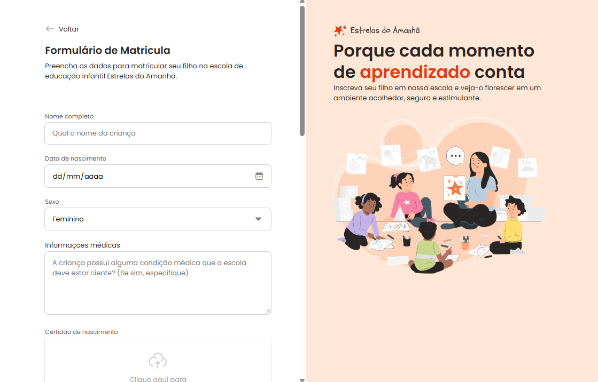

# 📋 Formulário de Matrícula

Projeto de aula da **Rocketseat** - Formulário web para praticar a primeira experiência com HTML `<form>` e estruturação semântica de formulários.

## 🎓 Sobre o Projeto

Um projeto educacional desenvolvido em aula pela **Rocketseat**, criado para aprender a implementar formulários HTML de forma correta e semanticamente adequada. O formulário simula uma matrícula em instituição de educação infantil.

### ✨ Primeira Experiência com `<form>`

Neste projeto aprendi a utilizar:
- Estrutura com `<fieldset>` e `<legend>`
- Atributos `method`, `enctype`, `name`
- Diferentes tipos de inputs: text, date, number, file, textarea, select
- Upload de arquivos com drag-and-drop
- Organização semântica de campos de formulário

## 🛠️ Tecnologias

- **HTML5** - Estrutura semântica de formulários
- **CSS3** - Organização modular em pastas temáticas (global, layout, forms, fields)
- **Google Fonts** - Tipografia Poppins

## 📁 Estrutura

```
├── index.html
├── assets/
│   ├── icons/
│   └── readme-image.png
└── styles/
    ├── global.css
    ├── layout.css
    ├── forms.css
    └── fields/ (buttons, checkbox, input, radio, droparea)
```

## 💡 Notas

Este projeto foi desenvolvido como exercício de aprendizado em desenvolvimento web, com foco especial na criação de formulários semânticos e acessíveis.

---

**Desenvolvido em aula com a Rocketseat**
